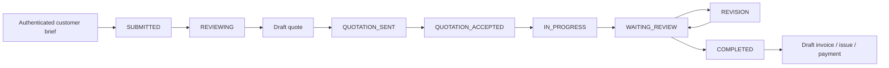
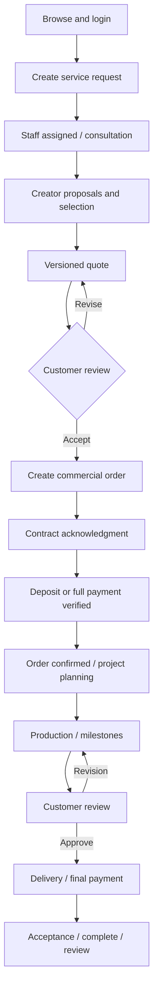

# Current approved service workflow

Updated 2026-10-03. `IMPLEMENTATION_PLAN.md` is authoritative; migrations through 030 are applied. Four account roles: CUSTOMER, STAFF, CREATOR, ADMIN; Guest browses public content. BUSINESS/STUDENT_CREATOR remain compatible historical identities, not newly issued product roles.

1. Customer selects a service and sends a consultation request. The longest-idle Staff receives it automatically; Staff is idle when they have no open consultation. One request creates one conversation.
2. Staff clarifies scope and proposes currently available company-contracted Creators. Customer can choose multiple Creators. Staff sends individual scopes/deadlines; each Creator must confirm within a 5–15 minute exclusive reservation.
3. All selected Creators must confirm before Staff publishes a quote. Published quote, order and contract retain immutable team snapshots. Customer accepts the quote, then explicitly acknowledges the latest contract terms. Current contract evidence is APPLICATION acknowledgment, not a provider e-signature.
4. Staff issues payment requests. Customer reports a real transfer; current Staff/Admin verifies exact actual bank evidence. The order is confirmed after verified receipts meet the agreed deposit, with new quotes requiring at least 30%. Quote acceptance frees Staff consultation capacity while order responsibility persists.
5. Staff plans production and milestones; Creators join the same conversation after their confirmation and customer contract acknowledgment. Shared progress is mandatory even when discussion occurs outside the system. Customer–Staff private commercial messages and financial records stay hidden from Creators.
6. Each Creator uploads watermarked review files. After all milestones complete, Staff sends a versioned review round covering the full team. Only Customer accepts the result or requests scoped revision; all rounds/files remain recorded.
7. Customer pays the remaining amount. Reports alone do not count. The responsible Staff separately confirms that verified receipts equal the entire order value. Each Creator then uploads the matching final file, declaring identical accepted content with watermark removed.
8. Only when every accepted review file has its final counterpart does the system complete the order/project and all Creator assignments. A Creator's 100% progress or partial final delivery cannot free their booking.

9. The owning Customer rates the achieved result and every Creator who delivered. Edits are allowed for seven days from the first submission. Customer chooses named/anonymous display; Creator comments are shown in the verified completed-order section of the public profile.
10. Admin prepares and reviews a separate small image/text excerpt of the completed project. The Customer name choice must be recorded, and Admin checks both image/text identity before publication. The public home/project feed shows only approved excerpts. A changed name choice withdraws the old presentation for re-review. Full deliverables and contract/payment records remain private.

Staff sees their own monthly/yearly attribution and current receivables; Admin sees company totals and Staff drill-down. New orders preserve the original closing Staff separately from the current operator. Receipts count by Vietnam business-month actual received time, even for older orders. Historical attribution is not guessed. Commissions are outside the system.

Still pending: variations/addenda, replacement/delay records, real amount-bound QR/provider e-sign/email integrations and browser acceptance. Cancellation/refund policy is deferred. The older notes below are historical.

# MediaHub Business Flow

Final user-approved flow: IMPLEMENTATION_PLAN.md supersedes earlier role/commission/assignment decisions below. Creator has an Admin-issued account; Staff auto-allocation chooses the longest-idle available Staff and releases consultation capacity on closing the quote. Creator becomes available only after project delivery. At least 30% deposit; watermarked review, full final payment verified by assigned Staff, then full unwatermarked delivery completes the project. Customer-initiated variations need accepted addenda. One request conversation persists throughout. Commissions and deferred refund policy are not automated.

Updated 2026-10-03. **Current implementation** and **target design** are distinguished below. Diagram states are not a claim that missing entities exist.

## Clarified product plan

MediaHub is a marketplace for media services, photography and production. Its four audiences are Guest, Customer, Staff and Admin; stored account roles are only CUSTOMER, STAFF and ADMIN. Creators and external business partners are managed profiles/relationships, not additional login roles.

Guest browses public services, creator portfolios and public projects. Customer chooses a service and preferred creator, or asks for advice, then opens a consultation request. Each request appears as its own card/conversation, with an explicit waiting state and the responsible Staff shown once assigned. Staff claims or receives the request, discusses the brief and proposes creators using filters for service/specialty, budget, location and relevant portfolio; availability must come from verified data. Customer inspects proposal details and makes a selection inside the conversation, without being sent to another website.

Staff prepares a quote, electronic contract and an order-specific deposit/full-payment request with amount/reference-bound QR. The Customer reviews and confirms the terms, then pays. Admin verifies the actual received funds before the order proceeds to production. Staff coordinates production, milestones, deliverables and revisions; Customer reviews and accepts the result, with remaining payment tracked through completion. Quotes, contracts, payment requests and creator proposals appear as actionable cards in the same conversation.

Admin manages the catalog, creator/partner profiles, Staff email invitations, assignment, verified financial reports and audit logs. Staff sees assigned work, performance and own estimated/approved/paid commissions; commission rules must be defined before calculating payouts. An invitation provides activation/password setup through email rather than an emailed plaintext password.

UI/UX priorities: clear service browsing and consultation entry; Customer conversation cards with responsible Staff, status and next action; Staff queue, creator finder and reusable commercial cards; Admin financial/account/log views. Audit and verify these flows on mobile and desktop, including waiting/loading/error/empty states and draft preservation. This is the revised plan, not a claim that QR, provider-backed electronic signing, invitation lifecycle or commissions are already complete.

## Guest Flow

Browse services/creators/portfolio → choose service → login/register → resume request. Public CONTACT enquiry remains available; PROJECT_REQUEST submission requires a customer account. Guest cannot view workspaces or send private chat.

## Customer Flow

Target: only CUSTOMER is the customer account role. Existing code still grants BUSINESS equivalent customer commerce permissions as legacy compatibility; this is pending normalization under the clarified plan. Current implementation supports separate requests, proposal selection, versioned quote acceptance and orders with versioned contract terms. Only the owner can acknowledge the latest unexpired terms with an explicit checkbox and exact server hash; immutable APPLICATION evidence moves the order to WAITING_PAYMENT. Legacy projects/invoices/payment reports remain available. New-order manual payments and production planning/milestones are implemented; deliverable review/final payment/acceptance remain pending.

## Staff Flow

Current: reduced request queue → atomic claim/assignment → consultation → creator proposals/selection → versioned quote → order → contract terms/application acknowledgment → payment request/customer report → Admin verifies receipt. Staff/Admin can transfer an active order; the RPC synchronizes request/order assignment, history and conversation membership while preserving status and keeping the reason private. Prior staff loses API/RLS access. Staff now creates production plans/milestones and starts/pauses work; deliverable review/acceptance follows later.

## Admin Flow

Current: accounts/invite, CMS, lead conversion, project/quote/invoice/payment administration and audit/revenue. Target adds staff invitation lifecycle, assignment controls, creators, operational/financial oversight, refunds and commission approval/adjustments. Never email a plaintext password.

## Current Legacy Project Lifecycle

Quote rejection cancels the legacy project. Draft quote editing overwrites that unpublished draft; sent quote cannot currently be revised. Legacy projects must keep their existing URLs/data through the new flow.

## Implemented Request Lifecycle (020–021)

UNASSIGNED → ASSIGNED → CONSULTING → CREATOR_SELECTION → QUOTE_PREPARING → QUOTE_SENT → CONVERTED. WAITING_CUSTOMER and QUOTE_REVISION are explicit pause/revision states; CANCELLED is terminal. READY_TO_ORDER is reserved and is not an exposed shortcut. Only the owning customer can select/respond; only the current operator/Admin can publish. Drafts remain private, sent content and items are immutable, and revisions create a new version. Acceptance requires the latest unexpired sent/viewed quote, matching selected creator and an active assigned operator. The atomic transaction creates one WAITING_CONTRACT order and preserves quote/creator/item snapshots. Retrying acceptance reuses the order. No project, invoice or payment is created yet.

## Target Order Lifecycle

WAITING_CONTRACT → WAITING_PAYMENT is implemented through owning-customer acknowledgment. Contract statuses are DRAFT, SENT, VIEWED, ACKNOWLEDGED, REJECTED, EXPIRED and CANCELLED. Published terms/history and exact-content evidence are immutable; rejection/cancellation/expiry permit a new version without rewriting history. No amendments after acknowledgment are implemented. Admin-verified receipts can move WAITING_PAYMENT → CONFIRMED; starting production moves CONFIRMED → IN_PROGRESS. WAITING_ACCEPTANCE → COMPLETED remains future work. Quoted amounts remain terms, not receipts. See [CONTRACT_INTEGRATION.md](CONTRACT_INTEGRATION.md) for the separate provider-backed signature integration.

## Implemented Production Foundation (024)

Confirmed order with immutable acknowledgment and enough verified receipt → operator creates one linked project in PLANNING → READY → IN_PROGRESS ↔ ON_HOLD. Starting requires at least one milestone and moves the order to IN_PROGRESS. Milestone PENDING → IN_PROGRESS → COMPLETED transitions require public reasons; only pending milestones can be edited. Transfer derives production access from current order assignment. New-origin legacy status stays DRAFT as an unused compatibility field; production_status controls execution. No invoice or completed order is inferred. See [PRODUCTION_WORKFLOW.md](PRODUCTION_WORKFLOW.md).

## Target Project Lifecycle

PLANNING → READY → IN_PROGRESS → WAITING_REVIEW ↔ REVISION → READY_TO_DELIVER → DELIVERED → COMPLETED. ON_HOLD/CANCELLED branches require reasons. Project is execution under an eligible confirmed order with customer, assigned staff, creator, milestones, deliverable versions, deadlines and revisions.

## Payment Lifecycle

Legacy: plan snapshots accepted quote total, percentage and two installment amounts. PENDING → REPORTED (customer claim only) → PAID (admin bank verification); balance reporting requires COMPLETED legacy project. No historical receipts/plans are changed.

Implemented new-order flow (023): acknowledge terms → operator issues bounded DEPOSIT/FULL/MILESTONE/REMAINING request → owner reports actual transfer (AWAITING_VERIFICATION) → Admin explicitly checks exact amount/bank transaction/time → immutable MANUAL_BANK receipt (PAID). Received funds meeting accepted deposit, or full total for zero-deposit terms, move WAITING_PAYMENT → CONFIRMED. Request-first/order locks, intent idempotency, reserved outstanding amounts and unique normalized transaction references prevent over-request/repeated receipt. Cancellation/expiry apply only to PENDING; reported transfers require Admin reconciliation. No production project or invoice is created yet. Refund/adjustment/partial receipt/zero-value confirmation and unified legacy reconciliation remain pending; see [PAYMENT_INTEGRATION.md](PAYMENT_INTEGRATION.md). Generic uploaded QR is omitted from new-order payments because it does not bind amount/reference.

Target: PENDING → AWAITING_VERIFICATION / PROCESSING → PAID, with FAILED/EXPIRED/CANCELLED/REFUNDED branches. Payment kind, due date, amount, reference and order are stored; backend verifies outstanding amount and prevents duplicate/mismatched confirmations. Collected revenue means verified receipts, not quote totals or customer reports.

## Commission Lifecycle

Not currently implemented. Target ESTIMATED → PENDING → APPROVED → PAID; ADJUSTED/CANCELLED events preserve history and reason. The business owner must define the revenue basis and policy; do not invent a rate or classify old invoices as paid commission.

## Compatibility Rules

- Preserve identities and existing business data during the migration to CUSTOMER/STAFF/ADMIN; review old BUSINESS/CREATOR/STUDENT_CREATOR account access and relationships rather than silently deleting or converting them. Creator/partner profiles remain separate business entities.
- Preserve existing projects/quotes/invoices and endpoints; new request/order relations are additive.
- Legacy completion is not evidence that a contract was signed or a deposit received.
- Never backfill fictional signatures, orders, financial receipts or commissions.
- Staff commerce access is introduced with explicit assignment checks, never by widening staff to all admin APIs.
